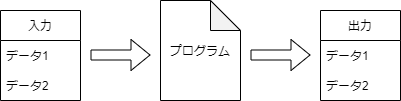
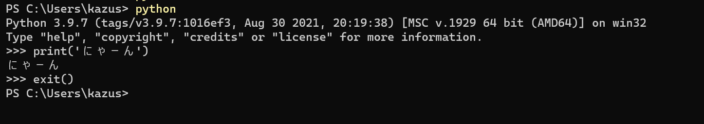
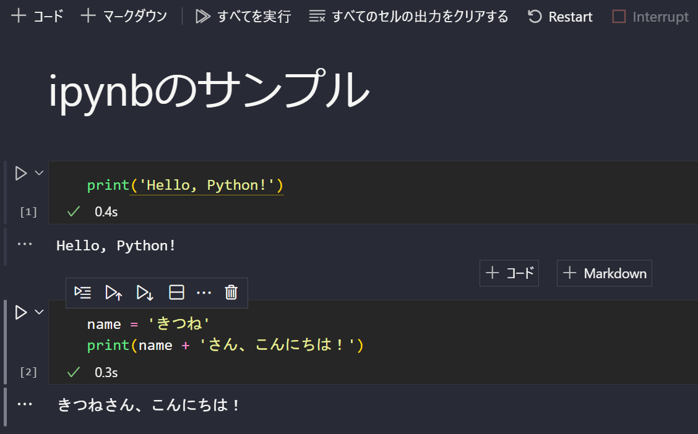
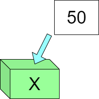
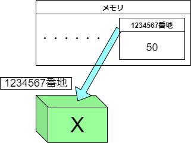

# Pythonで始めるプログラミング入門
<!--
_class: top
-->
## ~第1回 プログラミング概論~

# プログラムは何をするのか
任意の入力データを受け取ってデータを処理した結果を返す



# プログラミングの考え方はたったの4つだけ！
- 変数を使うこと
- 処理を分岐すること
- 繰り返すこと
- 処理をひとまとめにすること(関数)

# プログラミングの考え方はたったの4つだけ！
>プログラムの基礎は、たった四つ。数字に名前を付けること、もしも～って条件を分けること、繰り返すこと、服を脱ぐみたいな一連の動作を関数にして使うこと。他のことは、全部楽にプログラムを書くための小技。知らなくても大丈夫だよ

 (https://ncode.syosetu.com/n6813gp/17/
 『え、社内システム全てワンオペしている私を解雇ですか？』第17部分より)

# なぜプログラミングは難しいのか
### 4つしかないのになぜ難しく見える？
- コンピュータ/ウェブ上のデータへのアクセスはその方法を知らないとできない
- 他の人が用意した関数を理解して使いこなす必要がある
- 別の考え方(プログラミングパラダイム)で構築されたプログラムが存在する
- 少しでも書き間違えると動かない
...etc
# google検索をしよう！
え、そんなの知ってるって？

検索で自分の求める情報を自由に入手できる人は確実にプログラミングに向いています。

わからないことがあったら3秒で検索しよう。
地味に一番重要な能力！

# Pythonの使い方
## 方法1
拡張子が.pyのファイルにPythonのコードを書いてシェルで実行する。
例えば「Hello.py」を実行するなら
```bash
$ python3 Hello.py
```
# Pythonの使い方
## 方法2
シェルでpythonを起動して1行ずつ実行(対話モード)

# Pythonの使い方
## 方法3
拡張子が.ipynbのファイルはブロックごとに実行できる。


# Hello World
まずはここから！
由緒正しいもっともシンプルなプログラムです。
これを動かして無事に環境構築ができた喜びをかみしめよう。
```python
print('Hello, world!')
```
```
実行結果
Hello, world!
```

# ミスがある場合
たとえば '(シングルクォーテーション)を閉じ忘れている場合
```python
print('Hello, world!)
```
```
実行結果
  File "Hello.py", line 1
    print('Hello, world!)
                         ^
SyntaxError: EOL while scanning string literal
```
**エラーメッセージ**が表示され、発生している問題を教えてくれる。

# print関数
#### 与えたオブジェクトを決められた形で**標準出力**する関数。
#### 標準で末尾に改行が入ります。
```python
>>>print('Hello, world!')
Hello, world!
>>>print(1, 2, 3, 4, 5)
1 2 3 4 5
```
print関数のようにPythonで初めから使えるようになっている関数のことを **組み込み関数(Built-in functions)** と呼ぶ。
# コメントアウト
```python
# #で始まる文はコメントアウトアウトです
# プログラムを実行するときには無視されます
# 何を書いてもいいけど関係ないことは書かないようにね！
# これから挨拶します
# せーのっ！
print(3, 2, 1)
print('Hello, world!')
```
```
実行結果
3 2 1
Hello, world!
```


# 基本的な型
プログラムで扱うデータは何らかの型に分類されます
最初に覚えたいのは
- 整数型(int型、integer: 整数)
- 浮動小数点型(float型)
- 文字列型(str型、string: 文字列)

これらすべてのデータは**オブジェクト**とよばれます
# 基本的な型
```python
# 整数
1
# 小数
0.5
# 文字列(シングルクォーテーションまたはダブルクォーテーションで囲む)
'きつねさん'
"きつねうどん"

# これも文字列(数値も文字列になる)
'0'
'0.5'
```
# 変数と代入
変数はオブジェクト(値)を格納することができます。
たとえば
```python
day = 'Monday'
print('Today is')
print(day)
```
```
実行結果
Today is
Monday
```
# 変数と代入
## X=50の直感的な理解



# 変数と代入




## 正しい理解

#### 実際の値ではなく値が書きこまれたメモリ番地への参照が入る

# 演算子
## 計算はコンピュータの得意技！
```python
3 + 5  # 8
3+5    # 8
3 - 1  # 2
#掛け算は*(アスタリスク)
3 * 4  # 12
# 割り算は/(スラッシュ)
4 / 2  # 2.0
# 整数で返すときは//
4 // 2 # 2
4 // 3 # 1
```
# 演算子
## 文字列ならどうなる？
```python
'0'+'0' # '00'
'こん'+'にちは' # 'こんにちは'
'1'*4 # '1111'
```
## 文字列と数値を結合すると？
```python
'私は'+19+'歳です' # TypeError
```
# 型変換/埋め込み
### 異なる型を結合するときには型変換をする
```python
'私は'+str(19)+'歳です' # '私は19歳です'
```
### 文字列に値を埋め込むときはformat関数も使える
```python
age = 26
country = '日本'
name = '次郎'
job = 'ラーメン屋'
print('私は{}に住んでいる{}歳の{}と申します。職業は{}です。'.format(country, age, name, job))
# 私は日本に住んでいる26歳の次郎と申します。職業はラーメン屋です。
```

# 演習
1. A君とB君の身長を適当に定義し、変数に格納したのち、二人の身長の平均値を求めるプログラムを書きなさい

2. 半径rの円が与えられたとき(rは自分で適当な値を代入せよ)、その円の面積は半径1の円の面積の何倍かを説明するプログラムを書きなさい
```
実行結果例
A君の身長が150cm, B君の身長が165cmのとき、2人の身長の平均は157.5cmです。

半径4の円の面積は半径1の円の面積の16倍です。
