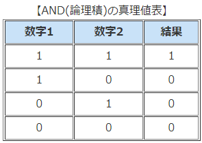
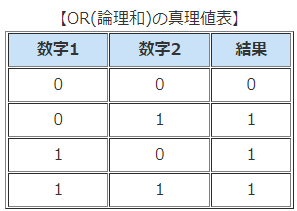

# Pythonで始めるプログラミング入門
<!--
_class: lead
_paginate: false
_header: ""
_footer: ""
-->
## ~第2回 条件分岐~

# 前回のあらすじ
- ### プログラミングの全体像を把握
- ### 基本的な型(int, float, str)
- ### 変数と代入
- ### 四則演算、剰余演算

# 今回やること
## 処理を分岐する
- #### 真偽値
- #### 条件式
- #### 論理演算
- #### 式と文
- #### 条件分岐

# 真偽値型
### True or Falseだけ！
- ##### 機能的には整数の1/0でもおなじことだけどわかりやすさのためにこれだけの型がある
- ##### 文字列の'True', 'False'とは別物なので注意
- ##### **T**rue/**F**alse のように大文字であることに注意
```python
>>> type('True')
<class 'str'>
>>> type(True)
<class 'bool'>
```

# 条件式
### 評価されるとTrue/Falseを返す式

```python
>>> 3 < 4
True
>>> 4 <= 4
True
>>> 3 == 2
False
>>> 4 != 5
True
```
# 比較演算子(基礎)
- ### \>, \<  　左辺の値が右辺を超過/未満
- ### >=, <= 　左辺の値が右辺以上/以下
- ### == 　左辺と右辺の値が等しい
- ### != 　左辺と右辺の値が異なる

# 式とは
### **式** --> 評価値をもつ（返す）かたまり
#### つまり、○○オブジェクトになるもの
```python
3 # int型オブジェクトなので式
3 + 5 # これも評価すると8というint型オブジェクトが返るので式
3 + 5.0 # 8.0という評価値のfloat型オブジェクトが返るので式
'alpha'+'bata' # 'alphabata'という評価値のstr型オブジェクトが返るので式
3==2 # Falseという評価値のbool型オブジェクトが返るので式
a = 3 # オブジェクトが返るわけではないので式ではない
a # 3という評価値のint型オブジェクトが返るので式
```
###### 式以外に何があるのか-->**文**

# 論理演算(否定)
## not A
Aをboolの評価値をもつ式とするとき、評価値を反転する演算

```python
>>> not 3==2
True
>>> not 2<3
False
>>> not (2>=2)
False
```

#  論理演算（論理積）
## A and B
A, Bをboolの評価値をもつ式とするとき、A,BがともにTrueのときにTrueを返し、それ以外のときにFalseを返す演算


# 論理演算（論理和）
## A or B
A, Bをboolの評価値をもつ式とするとき、A,BがともにFalseのときにFalseを返し、それ以外のときにTrueを返す演算


# 論理積、論理和の例
```python
# 変数を準備
a = 2
b = 3
# 論理積
a == 2 and b == 3 # -> True
4 <= a and a <= 6 # -> False

# 論理和
a == 2 or b == 1 # -> True
a != 2 or b != 3 # ->False

# ド・モルガンの定理(一つ上の式と等価)
not(a == 2 and b == 3) # -> False

```
# 条件分岐(if 文)
### (条件式)だったら～処理①する。
### そのあと、②に合流する
**if 条件式:**
**<indent> 処理①**
**処理②**
#### **重要**: 処理①の部分は必ず**インデント(空白)** を空ける
#### **重要2**: 条件式のあとに\:(コロン) を忘れない

# 条件分岐の例
```python
day = 'Monday'
if day == 'Saturday':
    print('明日も休みだ、むにゃむにゃ')
print('朝活の時間だよー！')
```
```python
day = 'Monday'
if day == 'Saturday' or day == 'Sunday':
    print('休日だ！')
print('今日も一日頑張ろう！')
```
# if-else


# if-elif-(else)
